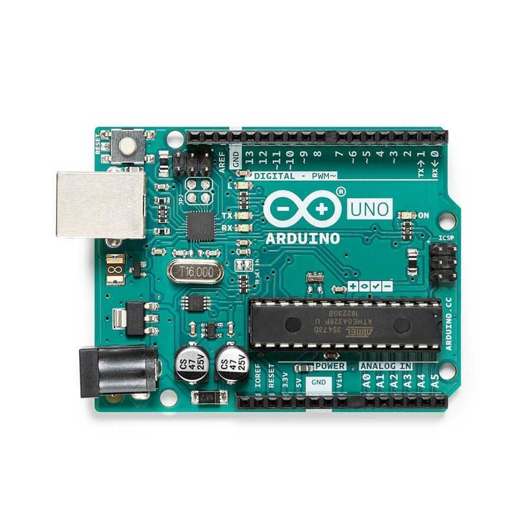

# Bölüm 2: Arduino Nedir ve Ekosistem Mimarisi

## 1. Genel Bakış ve Tanım
Arduino, tek başına sadece fiziksel bir mikrodenetleyici kartından ibaret değildir; donanım, yazılım (IDE), sensör/modül çeşitliliği, hazır kütüphaneler ve geniş bir geliştirici topluluğundan oluşan açık kaynaklı bir gömülü sistem ekosistemidir.

Geleneksel mikrodenetleyici geliştirme süreçlerinde karşılaşılan karmaşık donanım programlayıcıları ve yüksek maliyetli/zorlu geliştirme ortamlarını basitleştirerek hobi severlerden mühendislere kadar herkesin erişebileceği bir standart sunmuştur.

---

## 2. Ekosistem Bileşenleri
* **Donanım (Hardware):** Üzerinde mikrodenetleyici barındıran, dijital ve analog giriş/çıkış pinlerine sahip fiziksel kartlar (Örn: Arduino Uno, Nano, Mega).
* **Yazılım Ortamı (IDE):** Kodların yazıldığı, derlendiği ve karta yüklendiği geliştirme ortamı.
* **Kütüphaneler (Libraries):** Sensörlerin ve modüllerin (LCD ekran, motor sürücü vb.) mikrodenetleyici ile kolayca haberleşmesini sağlayan hazır fonksiyon paketleri (`#include <KutuphaneAdi.h>`).
* **Açık Kaynak Kültür (Open Source):** Geliştirilen devre şemalarının, pcb tasarımlarının ve kaynak kodlarının toplulukla paylaşılması ve ortak geliştirilmesi.

---

## 3. Temel Çalışma Mantığı ve Mimari
Arduino projeleri genel olarak üç temel katmandan oluşur:

* **Giriş (Input):** Sensörler, butonlar veya potansiyometreler aracılığıyla fiziksel dünyadan verilerin (sıcaklık, ışık, mesafe, voltaj) okunması.
* **İşlem (Processing):** Mikrodenetleyicinin (ATmega serisi vb.) gelen veriyi yazılan algoritma, mantıksal koşullar (`if/else`) ve döngülerle işlemesi.
* **Çıktı (Output):** İşlenen verilere göre aktüatörlerin (LED, motor, buzzer, ekran) tetiklenmesi.

---

## 4. Temel Kod İskeleti (Boilerplate)
Her Arduino programı (Sketch), temel olarak iki ana fonksiyondan oluşur. Bu yapı, tüm Arduino kodlarının temel şablonunu oluşturur:

<pre><code class="language-cpp">/*
 * Proje Adı: Temel Arduino Kod İskeleti
 * Açıklama: setup ve loop fonksiyonlarının çalışma mantığı.
 */

// Global değişken tanımlamaları ve kütüphane eklemeleri burada yapılır.

void setup() {
  // 1. Defaya mahsus çalıştırılan başlangıç ayarları
  // Örn: Pin modlarının belirlenmesi, Seri haberleşmenin başlatılması
  
  // Serial.begin(9600); // Seri haberleşmeyi başlatır
  // pinMode(13, OUTPUT);  // 13 numaralı pini çıkış olarak ayarlar
}

void loop() {
  // Sonsuz döngü: Program çalıştığı sürece bu blok sürekli baştan sona tekrarlanır.
  // Örn: Sensör okuma, koşul kontrolü ve çıkış verme işlemleri
  
  // digitalWrite(13, HIGH); // LED'i yak
  // delay(1000);            // 1 saniye bekle
  // digitalWrite(13, LOW);  // LED'i söndür
  // delay(1000);            // 1 saniye bekle
}
</code></pre>

  

